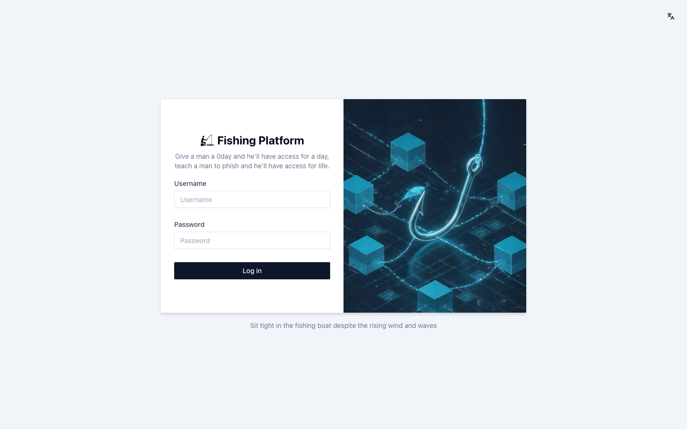

<p align="right">
  <b>English</b> · <a href="README.zh.md">中文</a>
</p>

<p align="center">
  <picture>
    <source media="(prefers-color-scheme: dark)" srcset="README.assets/logo-dark.svg" />
    
  </picture>
</p>

<h1 align="center">Fishing Platform</h1>

<p align="center">
  <strong>Open-source phishing toolkit for red teams</strong>
</p>

<p align="center">
  Go + Gin · Next.js · SQLite · one binary · optional remote agents
</p>

<p align="center">
  <a href="#what-it-is">What it is</a> ·
  <a href="#features">Features</a> ·
  <a href="#architecture">Architecture</a> ·
  <a href="#quick-start">Quick start</a> ·
  <a href="#agents">Agents</a> ·
  <a href="#console">Console</a> ·
  <a href="#docs">Docs</a>
</p>

---

## What it is

**Fishing Platform** (钓鱼台) is a self-hosted phishing toolkit. Stand up landing pages, send mail, watch opens and clicks, and get pinged when someone submits credentials. Run pages on the box or push them out to agents.

If you know Gophish: that's campaigns and templates. This is the ops box around it — pages, agents, live QR, AI gather, webhooks, blacklist.

One Go binary embeds the UI (`frontend/dist`) and serves API + console on the same port.

<p align="center">
  
</p>

> Use it only on targets you are allowed to phish. No authorization, don't.

---

## Features

- **Projects** — upload HTML (or pull a page into Page Builder). Run with Docker or local Flask. Optional TLS, agents, QR relay.
- **Mail** — SMTP profiles, bulk send, per-campaign open/click tracking (`/api/<slug>`). Noise in HTML if you want it.
- **Hooks** — Feishu, WeCom, Telegram, Slack, DingTalk, Discord. Bind a webhook to the project; submit → “fish on the hook” to chat. Opens/clicks do not fire this.
- **QR** — live QR image at `/q/{slug}.png`. A local script uploads screen frames; drop `{{QR_RELAY_URL}}` / `{{QR_RELAY_IMG}}` in the page.
- **Info gathering** — point at your own AI endpoint (`/responses` + `web_search`). Pull public emails/phones, export CSV, hand off to mail.
- **Agents** — extra binary on other hosts. Many projects per agent, many agents per project. Logs and submits come home.
- **Housekeeping** — dashboard + host graphs, encrypted passwords at rest, IP geo (QQWry), CSV export, IP blacklist (spray submits → drop the IP so blue team can't flood you), JWT + optional Basic Auth, admin/operator, append-only audit log, EN/ZH UI.

Usual path: SMTP + webhook → page → project (bind the channel) → send → wait for the hook ping → records. If someone starts spraying submits, blacklist the IP.

---

## Architecture

```text
  Browser (EN/ZH, JWT)
           │
           ▼
  Control plane  (Go / Gin, SQLite, embedded UI)
           │
     ┌─────┴──────┐
     ▼            ▼
  Docker /     Remote agents
  local Flask
     │            │
     └─────┬──────┘
           ▼
  submits · logs · mail open/click · live QR
```

Go 1.24, Gin, GORM/SQLite, Next.js static export, optional Docker SDK.

---

## Quick start

Needs Linux, macOS, or Windows.

- **Run a release binary:** just the binary + `config.yaml`.
- **Build from source:** Go **1.24+**, Node.js (frontend).
- **Docker run mode:** Docker Engine (SDK talks to it). Skip if you only use local Flask / agents.
- **Local Flask run mode:** `python3` with Flask (`flask`, `flask_cors`, `requests`).
- **QR capture:** Python 3 + the zip from **Workbench → QR Phishing** (or [`scripts/qr-relay`](scripts/qr-relay/README.md)). macOS wants `zbar` for decode.
- Agents must reach the control plane over HTTP(S).

| What | Default |
|------|---------|
| Console / API | `:8000` |
| Frontend dev | `:8081` → proxies `/api` to `:8000` |
| Agent landing pages | `10000–20000/TCP` on the agent host |

### 1. Config

```bash
cp config.yaml.example config.yaml
```

Swap the placeholders before you actually use it:

```yaml
server:
  port: 8000
  gin_mode: release

database:
  path: ./data/fishing.db

security:
  encryption_key: replace-with-a-generated-key
  jwt_secret: replace-with-a-long-random-secret
  container_secret: replace-with-another-long-random-secret
  agent_registration_token: replace-with-agent-registration-token
  platform_basic_auth_enabled: true

container:
  ssl_cert_path: /app/certificates/cert.pem
  ssl_key_path: /app/certificates/key.pem
```

`cmd/generate-encryption-key` can mint `encryption_key`. Mail tracking (public URL, HMAC, redirect allow-list) lives under **System → Mail Tracking** after boot. YAML is seed/fallback only. Click/open paths are generated per campaign, not globally.

Don't commit `config.yaml`, `data/`, or TLS keys (they're gitignored).

### 2. Run

```bash
./fishing-platform
# or a build from ./release/ after ./build-all.sh
```

If it complains about empty/default secrets, that's fine on a lab box. Rotate them before a real job.

### 3. Build

```bash
./build-all.sh
```

Frontend first, then control plane + agent for linux/windows/darwin (amd64 & arm64). Copies `config.yaml.example` and `agent.yaml.example` into `release/`.

UI only (API already up):

```bash
cd frontend && npm install && npm run dev   # http://127.0.0.1:8081
```

### 4. Login

Open `http://localhost:8000` (or your `server.port`). First boot dumps admin creds here:

```bash
cat data/admin_password.txt
```

Save it, delete the file. Later resets: `cmd/reset-password`.

---

## Agents

Don't want everything on the control plane? Drop **fishing-agent** on other machines. One project can hit many nodes; one node can host many projects. Each binding gets its own port, revision, and logs. Submits/logs go back to the mothership. If the plane blinks, the agent buffers and retries.

Project ports default to **`10000–20000/TCP`**. The agent dials **out** to the control plane. Visitors hit the agent (or `advertise_host` behind a reverse proxy — see the full guide).

**Token** — set `security.agent_registration_token` on the plane (not the JWT secret) and restart. First register uses that shared token once, then `{work_dir}/state.json` holds the per-agent id/token (`0600` on Linux/macOS).

**Start** — `./build-all.sh` puts binaries + `agent.yaml.example` in `release/`:

```bash
cp agent.yaml.example agent.yaml
```

```yaml
server_url: http://control-plane.example.com:8000   # no trailing slash
registration_token: replace-with-a-long-random-agent-token
```

```bash
chmod +x ./fishing-agent
./fishing-agent -config ./agent.yaml
```

```powershell
.\fishing-agent-windows-amd64.exe -config .\agent.yaml
```

You want a log line like `agent … connected to http://…`.

**In the UI** — **System → Agents** until it's online (~90s without heartbeat = offline). **Projects → New**, pick agents, upload HTML. Each agent is its own instance (`pending` → `deploying` → `running`). Logs and records roll up on the project. Edit = new revision; add agent = deploy; uncheck = delete task.

systemd, Windows service, proxy: **[docs/agent-deployment.md](docs/agent-deployment.md)** (Chinese).

---

## Console

| | |
|---|---|
| **Dashboard** | Counts and host CPU/mem |
| **Projects** | Overview, deployments, logs, records |
| **Audit Logs** | Admin, no delete |
| **Send Email** | Campaigns, open/click |
| **Page Builder** | Upload / AI mirror |
| **Info Gathering** | AI search → contacts |
| **QR Phishing** | Live QR relay |
| **Push Channels** | Webhook when someone submits |
| **Agents** | Online / last seen |
| **IP Blacklist** | Spray submits → ban the IP, keep blue team from flooding you |
| **Mail Services** | SMTP |
| **Users / AI / Mail Tracking** | Admin |

Pages POST to `/api/submit` by default. HTML: `{{SUBMIT_URL}}`, `{{REDIRECT_URL}}`, `{{QR_RELAY_URL}}`, `{{QR_RELAY_IMG}}`. Mail: `{{email}}`, `{{click_url}}`, `{{open_pixel}}`, `{{landing_url}}`, …  
Guides: [EN](docs/placeholders.en.md) · [ZH](docs/placeholders.zh.md)

Access log: `data/access-YYYY-MM-DD.log`. Fast dashboard polls stay out of the console, still in the file.

---

## Docs

| | |
|---|---|
| Placeholders (pages + mail) | [EN](docs/placeholders.en.md) · [ZH](docs/placeholders.zh.md) |
| Agents (systemd, Windows, proxy) | [docs/agent-deployment.md](docs/agent-deployment.md) |
| QR capture script | [scripts/qr-relay](scripts/qr-relay/README.md) — or download the zip from the QR page |

QR: create a relay in the console, copy the upload token (shown once), drop it in the script config. It only uploads image frames + heartbeat. Public URL is `/q/{slug}.png`.

---

## Security

- Rotate `encryption_key`, `jwt_secret`, `container_secret`, `agent_registration_token`. Changing `encryption_key` breaks stored ciphertext (SMTP, robot secrets, captured passwords, mail-tracking secret).
- Exposed console: `gin_mode: release` + Basic Auth.
- Treat captures, recipient lists, webhook URLs, and AI keys as live ammo.
- Audit log is not deletable in the product API. Operators only see their own stuff.

---

## Stuck?

| | |
|---|---|
| Can't open the UI | Port in `server.port`. If Basic Auth is on, the browser asks twice (perimeter then login). |
| No admin password | `data/admin_password.txt` on first boot. Later: `cmd/reset-password`. |
| Agent stays offline | It must **dial out** to `server_url`. ~90s without heartbeat = offline. Token must match `agent_registration_token` on first register. |
| Mail opens/clicks are empty | **System → Mail Tracking**: enable it, set `public_base_url` to a URL the victim can actually hit. |
| Local Flask won't start | `python3` in PATH, `pip install flask flask_cors requests`. |
| Docker mode skipped | Engine not reachable (default `127.0.0.1:2375` in the startup check). Use local Flask or agents. |
| QR health is stale | Capture script not running, or token/URL wrong. |

---

## Layout

```text
main.go / handlers / models / middleware / utils / config
agent/                 # edge binary
frontend/              # Next.js → frontend/dist (embedded)
cmd/                   # generate-encryption-key, reset-password
docs/agent-deployment.md
docs/placeholders.en.md
docs/placeholders.zh.md
config.yaml.example
agent.yaml.example
build-all.sh
README.md / README.zh.md
README.assets/
```

---

## Disclaimer

This is for red-team phishing **with permission**. Using it against people or systems you don't have authorization for is on you, and we don't support that.

Code is under the [MIT License](LICENSE).

Issues and PRs welcome. Open a GitHub Issue if something's broken.
